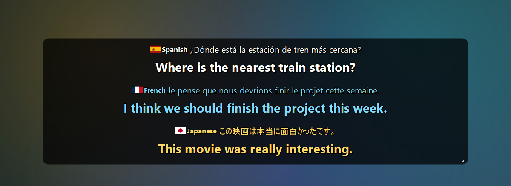
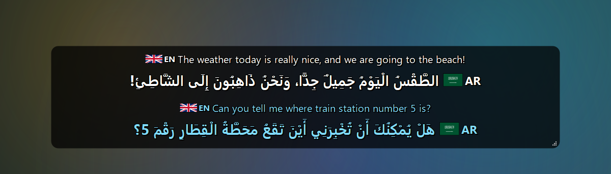
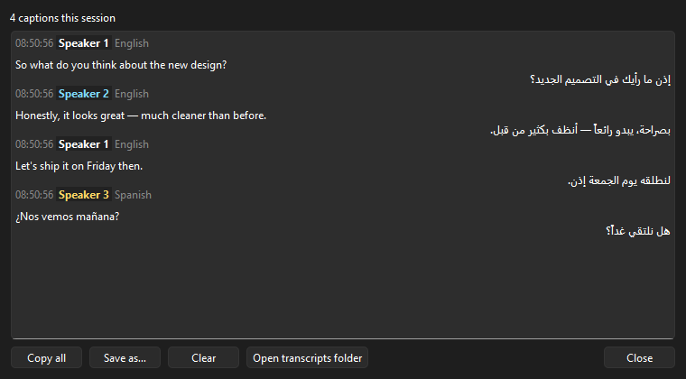
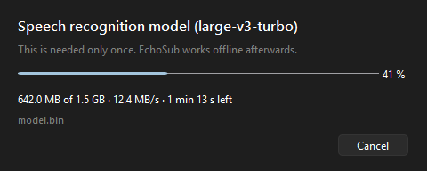
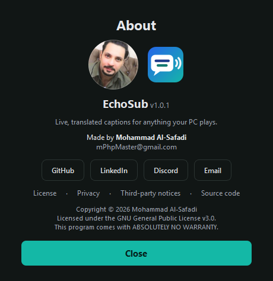

<p align="center">
  
</p>

<h1 align="center">EchoSub</h1>

<p align="center">
  <b>Live, translated captions for anything your PC plays.</b><br>
  Videos, streams, calls, games — heard, transcribed and translated on your own GPU.
</p>

<p align="center">
  <a href="LICENSE"></a>
  
  
</p>

<p align="center">
  
</p>

---

## What is EchoSub?

EchoSub listens to whatever comes out of your speakers, recognizes the speech in almost 100 languages, translates it into the language you choose, and shows it in a transparent, always-on-top caption box. It works with any app — a YouTube video, a Twitch stream, a Discord or Teams call, a game, a movie — because it captures the audio after it leaves the app, not inside it.

Everything runs locally: speech recognition and translation happen on your own machine (with an optional Google Translate engine if you prefer), and nothing you hear is uploaded.

## Features

**Recognition & translation**
- Captures system audio through WASAPI loopback and follows you when you switch speakers/headphones; recovers by itself if a device is unplugged.
- Speech recognition with [faster-whisper](https://github.com/SYSTRAN/faster-whisper) (Whisper large-v3-turbo by default), automatic language detection, almost 100 languages.
- Offline translation with NLLB-200 (600M or 1.3B), or Google Translate.
- Captions appear the moment a sentence is recognized; the translation replaces it a fraction of a second later.
- Speech already in your caption language can still be "translated", turning dialect or casual speech into the standard language.
- Moroccan Arabic (Darija) as a spoken and caption language.
- Optional Arabic diacritics (تشكيل) on the translation and/or the original text.
- Model downloads show a progress window with speed and time left, can be canceled, and resume where they stopped.

**Speakers**
- Recognizes different voices: every person gets a new line and their own color (up to 8 voices).

**Caption box**
- Language labels (code, name, flag) on the original text and on the translation — before, after, above or below.
- Fonts, sizes, colors, bold, line height and spacing for original and translated text separately.
- Text alignment, 9 screen positions (or drag it anywhere), multi-monitor, autosize, corner radius and padding.
- Smooth slide / fade animations for new lines, changed text, and the box resizing.
- Hides itself when nobody is talking; stays while your mouse is over it.
- Click-through lock, global hotkeys (`Ctrl+Alt+H` show/hide, `Ctrl+Alt+P` pause, `Ctrl+Alt+L` lock).

**Everything else**
- Caption history window (copy / save) and optional automatic transcripts.
- Live preview while you change settings; searchable dropdowns; restore defaults.
- Tray icon with status (loading, listening, paused, error), log file, single instance.

## Screenshots

| Any language in, your language out | Arabic diacritics (تشكيل) |
|---|---|
|  |  |

| Language & engine | Text & colors |
|---|---|
|  |  |

| Position, alignment & animation | Speakers |
|---|---|
|  |  |

| Caption history | Model download | About |
|---|---|---|
|  |  |  |

## System requirements

|  | Minimum | Recommended |
|---|---|---|
| **Operating system** | Windows 10, 64-bit | Windows 11, 64-bit |
| **Processor** | 64-bit, 4 cores (e.g. Intel Core i3-8100 / AMD Ryzen 3 2200G) | 6+ cores (e.g. Intel Core i5-9400F / AMD Ryzen 5 3600) |
| **Memory (RAM)** | 8 GB | 16 GB |
| **Graphics** | None required — runs on the CPU with the *Small* or *Base* speech model (captions lag several seconds) | NVIDIA GeForce GTX 1060 6 GB or better (GTX 10-series and newer); RTX cards are faster |
| **Graphics memory** | 4 GB for the default models on an NVIDIA GPU | 6 GB or more (needed for *NLLB 1.3B* or *Large v3*) |
| **NVIDIA driver** | 527.41 or newer (CUDA 12) | Latest Game Ready or Studio driver |
| **Free disk space** | 6 GB (app 2.3 GB + default models 2.3 GB) | 10 GB on an SSD (room for all models) |
| **Internet** | Once, to download the models (~2.3 GB) | Also needed if you use the Google Translate engine |
| **Audio** | Any Windows playback device (speakers, headphones, virtual devices) | — |
| **Display** | 1280 × 720 | 1920 × 1080 or higher |

EchoSub picks the fastest precision for your GPU automatically (for example int8 on GTX 10-series cards, which have no fast float16).

### Models

Choose the models in *Settings → Language & Engine*. Download sizes are exact; graphics memory is an estimate for the loaded model; speeds were measured on an Intel Core i5-9400F with a GTX 1060 6 GB **while a game was using the GPU at 99%** — an idle GPU is faster.

| Model | Download | Graphics memory (est.) | Time to caption a 9-second sentence |
|---|---|---|---|
| Speech — *Base* | 141 MB | ~0.3 GB | 1.3 s (GPU) |
| Speech — *Small* | 464 MB | ~0.5 GB | 2.5 s (GPU) · 10.7 s (CPU) |
| Speech — *Medium* | 1.5 GB | ~1.0 GB | 2.9 s (GPU) |
| Speech — *Large v3 Turbo* (default) | 1.5 GB | ~1.2 GB | 2.2 s (GPU) · 64 s (CPU — not usable live) |
| Speech — *Large v3* | 3.1 GB | ~2.0 GB | slower than Turbo |

| Translation model | Download | Graphics memory (est.) | Time to translate a sentence |
|---|---|---|---|
| *NLLB 600M* (default) | 617 MB | ~0.8 GB | 0.22 s (GPU) · 1.4 s (CPU) |
| *NLLB 1.3B* | 1.3 GB | ~1.6 GB | 0.47 s (GPU) |
| *Google Translate* | — | — | depends on your connection |

Also downloaded: the speaker detection model (27 MB, runs on the CPU) and, only if you turn on Arabic diacritics, the diacritics model (69 MB, CPU).

**Default setup** (Large v3 Turbo + NLLB 600M + speaker detection): about 2.3 GB to download and about 2 GB of graphics memory.

## Install

1. Download `EchoSub-Setup-<version>.exe` from the [Releases](https://github.com/mPhpMaster/echo-sub/releases) page.
2. Run it and follow the steps (you can install for all users or just for you).
3. Start EchoSub. The first start downloads the AI models (~2.3 GB) in a progress window that you can cancel at any time — the download resumes where it stopped next time. After that EchoSub works offline (unless you choose Google Translate).

Settings, models, logs and transcripts are kept in `%LOCALAPPDATA%\EchoSub`. The uninstaller asks whether to remove them.

## Using EchoSub

- **Menu:** right-click the caption box, or click the EchoSub icon in the system tray (next to the clock).
- **Translation language:** menu → *Translation language*, or *Settings… → Language & Engine* for all languages.
- **Move / resize:** menu → *Adjust window position and size*, then drag the box or its corner; or pick a spot under *Settings… → Position & Alignment*.
- **Lock:** menu → *Lock window (click-through)* makes clicks pass through the box; unlock from the tray icon or `Ctrl+Alt+L`.
- **History:** menu → *Caption history…*.
- **Tray icon dot:** blue = listening, amber = loading or reconnecting, grey = paused, red = error.

If captions lag, choose a smaller speech model (Settings → Language & Engine → *Small* or *Medium*). The full [User Guide](docs/USER_GUIDE.md) explains every setting and common fixes.

## Build from source

You need Windows, **Python 3.10 (64-bit)** and, for the installer, [Inno Setup 6](https://jrsoftware.org/isinfo.php).

```powershell
# run EchoSub from source (creates .venv and installs dependencies on first run)
powershell -ExecutionPolicy Bypass -File scripts\dev.ps1

# build the app into dist\EchoSub\EchoSub.exe
powershell -ExecutionPolicy Bypass -File scripts\build.ps1

# build the app and the installer dist\installer\EchoSub-Setup-<version>.exe
powershell -ExecutionPolicy Bypass -File scripts\build-installer.ps1
```

See [docs/DEVELOPMENT.md](docs/DEVELOPMENT.md) for the project layout, how the pipeline works, and all script options.

## Privacy

EchoSub processes audio on your computer. Audio and captions are never uploaded — except the caption text sent to Google if you select the Google Translate engine. See [PRIVACY.md](PRIVACY.md).

## Contributing

Bug reports, ideas and pull requests are welcome — please read [CONTRIBUTING.md](CONTRIBUTING.md) and the [Code of Conduct](CODE_OF_CONDUCT.md) first. Security issues: see [SECURITY.md](SECURITY.md).

## License

**Copyright © 2026 Mohammad Al-Safadi.**

EchoSub is free software: you can redistribute it and/or modify it under the terms of the **GNU General Public License version 3** as published by the Free Software Foundation. It is distributed in the hope that it will be useful, but WITHOUT ANY WARRANTY; without even the implied warranty of MERCHANTABILITY or FITNESS FOR A PARTICULAR PURPOSE. See [LICENSE](LICENSE) for the full text.

EchoSub uses third-party libraries and downloads AI models that have their own licenses — see [THIRD_PARTY_NOTICES.md](THIRD_PARTY_NOTICES.md). **Note:** the default offline translation model (NLLB-200) is licensed for **non-commercial use only**; for commercial use, select the Google Translate engine or another model.

## Author

**Mohammad Al-Safadi**

[GitHub](https://github.com/mPhpMaster) · [LinkedIn](https://www.linkedin.com/in/mohammad-al-safadi/) · [Discord](http://discord.com/invite/BRgVPum) · [mPhpMaster@gmail.com](mailto:mPhpMaster@gmail.com)
