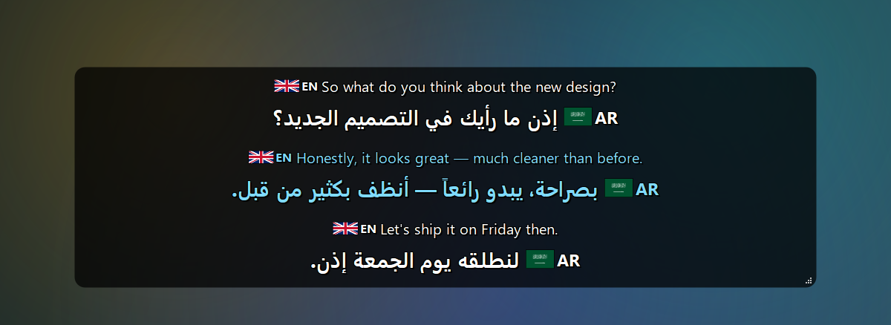
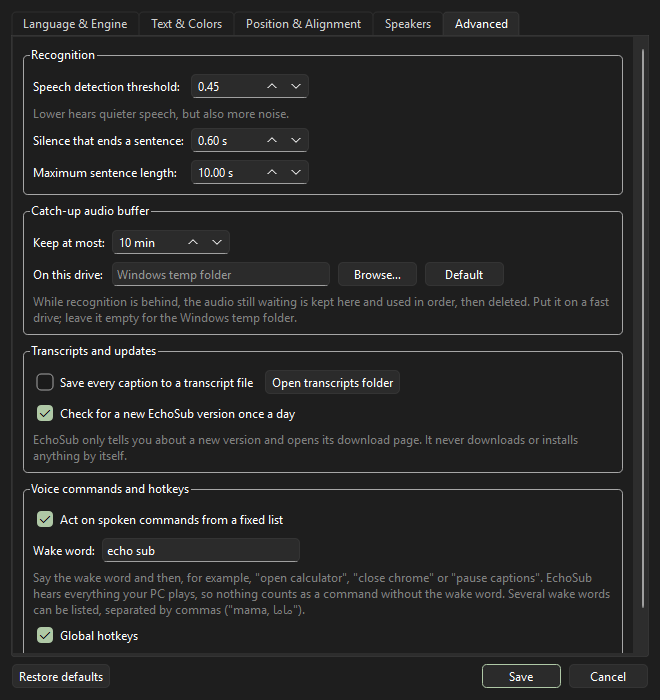
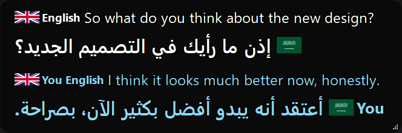
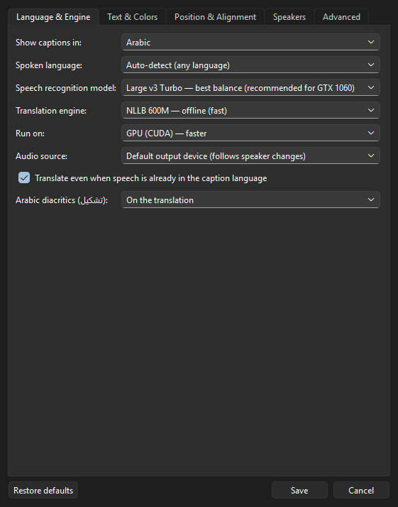
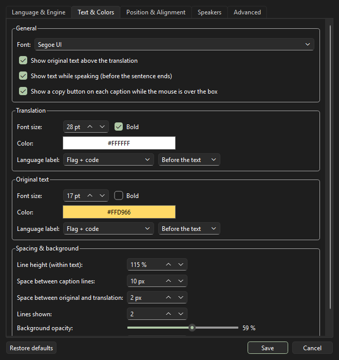
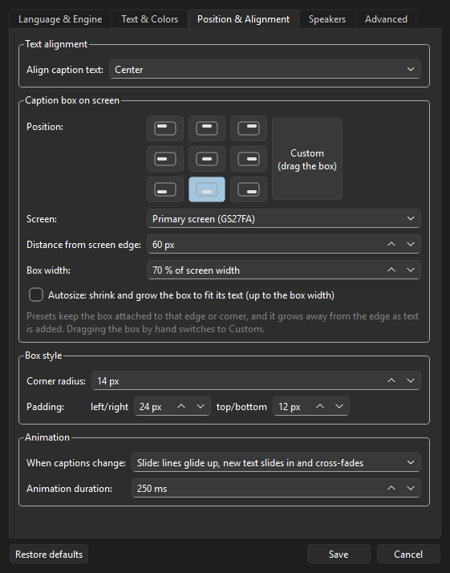
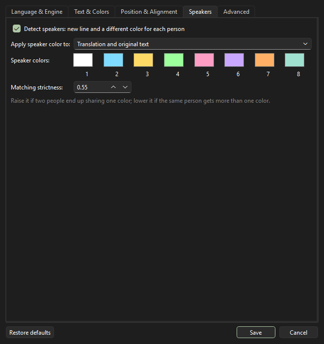

# EchoSub — User Guide

## Before you install

Check the [system requirements](../README.md#system-requirements): Windows 10/11 64-bit, 8 GB RAM, and ideally an NVIDIA GPU with 4 GB+ of graphics memory. Without an NVIDIA GPU, choose the *Small* speech model.

## First start

1. Start EchoSub from the Start menu. Its icon appears in the system tray (next to the clock).
2. The first start downloads the AI models (~2.3 GB). A window shows the progress, speed and time left; **Cancel** stops it and **Retry** continues where it stopped (nothing already downloaded is lost). Later starts take a few seconds.
3. Play anything with speech. Captions appear at the bottom of the screen and disappear when nobody is talking.

The small dot on the tray icon shows the status: **blue** listening · **amber** loading or reconnecting audio · **grey** paused · **red** error (hover for details).

## Menu

Right-click the caption box or click the tray icon:

| Item | What it does |
|---|---|
| Translation language | Quick switch between common languages (all ~100 are in Settings) |
| Show captions `Ctrl+Alt+H` | Turn the caption box on/off |
| Adjust window position and size | Shows the box with sample text so you can drag it or resize it from its corner |
| Lock window (click-through) `Ctrl+Alt+L` | Clicks go through the box to the app underneath |
| Pause `Ctrl+Alt+P` | Stop listening |
| Clear captions | Remove the current text |
| Caption history… | Everything captioned this session, with Copy all / Save as… |
| Settings… | All options, with live preview on the caption box |
| Open log file | For troubleshooting |
| Restart engine | Reload the models and audio device |
| About EchoSub… | Version, author, license, links |

The hotkeys work while other apps (games, videos) have focus. If another program already uses one, EchoSub tells you; they can be turned off in Settings → Advanced.

## When captions lag behind

Speech recognition is the slow part, and it shares the graphics card with whatever else is running. If captions arrive late:

- Turn on **Light mode** (tray menu, or *Settings → Language & Engine*). It uses the *Small* speech model and turns live text off; your own settings are kept and return when you turn it off. Measured on a GTX 1060 6 GB **while a game was using the card**: a 5-second sentence took 2.4 s with *Large v3 Turbo* and 0.9 s with *Small*, and captions for a 39-second clip arrived about 1.5 s sooner each.
- Or pick a smaller model yourself in *Settings → Language & Engine*, and turn off *Show text while speaking*.

While it catches up, the audio still waiting is kept in a temporary folder (*Settings → Advanced → Catch-up audio buffer*) and recognized in order, so nothing said is lost. **Keep it on this drive** picks the folder — put it on your fastest drive; writing a minute of audio took 0.1 s on an SSD and 0.24 s on a slower drive here, and reading it back 0.9 s against 2.5 s. Leave it empty for the Windows temp folder, and set the buffer to 0 min to switch it off. The folder is emptied as the audio is used and deleted when EchoSub closes.

EchoSub never lets the delay grow without end: when it cannot keep up it drops the oldest audio that is still waiting, and when the translator is behind it shows the oldest captions in their original language. Both are reported in the status line.

## Your microphone

EchoSub normally captions what the PC plays. Turn on *Settings → Language & Engine → Microphone* and it captions
what you say as well, on the same models, so a call with someone reads as one list of lines.

- **Microphone** — which device to listen to; *Default* follows Windows.
- **Shown as** — the label on your captions ("You" by default), so it is clear who said what.
- **Its colour** — your captions are drawn in this colour.
- **Accept spoken commands from the microphone too** — on by default, so you can say "echo sub, open calculator"
  yourself. Turn it off to be captioned without being obeyed.

Your voice is never mixed with the other sound: the two are recognized separately and never merged into one line.
Speaker detection is not run on your microphone — it is you.

## Voice commands

Off by default. Turn them on from the tray menu (*Voice commands*) or *Settings → Advanced*.

EchoSub hears everything your PC plays, so a video saying "open the calculator" must not open it: a command
counts only when the **wake word** comes first. The wake word is "echo sub" and you can change it in the settings.

| Say | What happens |
|---|---|
| "echo sub, open calculator" / "افتح الحاسبة" | The app opens |
| "echo sub, close calculator" | The app closes |
| "echo sub, pause captions" / "resume captions" | Captions pause or continue |
| "echo sub, hide captions" / "show captions" | The caption box hides or comes back |
| "echo sub, clear captions" | The box is emptied |

The apps it can open and close: **Calculator, Notepad, Paint, File Explorer, Windows Settings, Task Manager,
Snipping Tool, On-screen keyboard, Magnifier, Character Map, Chrome, Edge, Firefox, VLC, VS Code, Discord,
Steam and Spotify**. If an app is not installed, EchoSub says so instead of doing nothing.

Closing is the same as clicking the window's X, so an app with unsaved work still asks you about it. Two
exceptions keep nothing and ignore a polite request, so they are simply ended: Calculator and the on-screen
keyboard. File Explorer only has its folder windows closed — never the desktop or the taskbar.

Commands work in the languages EchoSub captions, not only English: "ouvre la calculatrice", "abre la calculadora", "öffne den rechner", "открой калькулятор", "打开计算器", "電卓を開いて", "계산기 열어", "altyazıları duraklat", "اخف الترجمة" and so on. Endings are allowed, so Turkish "hesap makinesini kapat" works too.

That is the whole list, and it cannot be extended from the settings. Nothing you say is ever run as a command
on your PC: shutting down, deleting files, opening a terminal and anything similar are simply not recognized.
**The wake word on its own switches captions off and back on.** Say just "echo sub" (or whatever name you
chose) and the captions pause; say it again and they come back. A name inside an ordinary sentence does nothing —
the whole caption has to be the name.

**Websites:** "echo sub, open YouTube" and "echo sub, open Google" open those two addresses in your own browser.
The addresses are written into EchoSub; a spoken word can never become a web address.

**On-screen answers** (*Settings → Commands*, off by default) are for a shared screen: when someone says the wake
word and one of your phrases, EchoSub writes your own prepared line in the caption box, in its own colour and
labelled EchoSub, and takes it away again after a few seconds. Nothing is sent to Discord or anywhere else, no
message is typed into another program, and no answer is generated — every line is one you wrote in the settings.

Commands are read from finished captions only, never from live text, and they are ignored while captions are paused. If EchoSub hears the wake word but the rest is not a command, it shows a short notification with what it heard, so you can see how it understood you — at most one such notice every few seconds.

## When the sound device disconnects

If the device disappears (a USB card unplugged, a driver restart), EchoSub reconnects by itself, trying every
few seconds. If you picked a specific device in the settings and it is missing, EchoSub listens to the default
device and says so in the status line, then moves back to yours as soon as it is available again.

## Copying a caption

Move the mouse over the caption box: a small copy button appears next to every line, the original and the translation. Click it to copy that line's text to the clipboard — the button shows a check mark for a moment. Turn the buttons off in *Settings → Text & Colors*. They don't appear while the box is locked (click-through).

## Settings

Every dropdown accepts typing to search (e.g. type `ital` for Italian; Arabic names work too, with or without hamza).

### Language & Engine

- **Show captions in** — the language captions are translated into.
- **Spoken language** — *Auto-detect* works for any language; choosing the language improves accuracy.
- **Speech recognition model** — *Large v3 Turbo* is the best balance; *Small*/*Medium* are faster on weaker GPUs.
- **Translation engine** — *NLLB 600M* (offline, fast), *NLLB 1.3B* (offline, more accurate), *Google Translate* (online), or *No translation*. If Google Translate starts refusing requests (it limits how much one computer can translate), EchoSub waits a little and tries again; meanwhile it translates offline with an NLLB model if you have downloaded one before.
- **Run on** — GPU (CUDA) or CPU. **Audio source** — follow the default output device, or pick one.
- **Translate even when speech is already in the caption language** — rewrites dialect or casual speech into the standard language (e.g. Egyptian or Gulf Arabic into Modern Standard Arabic).
- **Arabic diacritics (تشكيل)** — adds harakat to Arabic captions: on the translation, the original text, or both. Turning it on downloads a 70 MB model once. Sentences mixing Arabic with other languages get less accurate harakat.
- **Moroccan Arabic (Darija)** — choose it as *Show captions in* to get captions in Darija, or as *Spoken language* when the audio is Darija (auto-detect hears Darija as Arabic). *NLLB 1.3B* gives noticeably better Darija than *NLLB 600M*.

### Text & Colors

- Font; show the original text above the translation; show live text while someone is still talking.
- **Translation** and **Original text**: font size, bold, color, and a **language label** (code, name, flag, flag + code, flag + name, or nothing) placed before, after, above or below the text. "Before"/"after" follow the reading direction.
- **Spacing & background**: line height (any value, including below 100%), space between caption lines, space between original and translation, number of lines, background opacity, and how long after silence the box hides (it never hides while the mouse is over it).

### Position & Alignment

- **Text alignment** — center, left, right, or follow the reading direction.
- **Position** — 9 spots on the screen or *Custom* (drag the box anywhere; dragging switches to Custom automatically). **Screen**, **distance from the screen edge** and **box width**.
- **Autosize** — the box shrinks and grows to fit its text, up to the box width.
- **Box style** — **size (zoom)**, corner radius (0 = square) and padding. Size scales the whole box: text, language labels, spacing, padding, corners and width. Shortcut: hold **Shift** and turn the mouse wheel over the box (10 % per notch, 50–300 %); it stops growing while the box still fits the screen. To undo it: the **100%** button here, or right-click the box → *Caption size: back to 100%*. This doesn't work while the box is locked (click-through).
- **Animation** — *Slide* (lines glide, text cross-fades, the box resizes smoothly), *Fade*, or *None*, and the duration.

### Speakers

- **Detect speakers** — a new line and color for each voice. **Apply speaker color to** the translation, the original, or both. **Speaker colors** for up to 8 voices.
- **Matching strictness** — raise it if two people share a color; lower it if one person gets several colors.

### Advanced
- Speech detection threshold, silence that ends a sentence, maximum sentence length.
- **Save every caption to a transcript file** (in `%LOCALAPPDATA%\EchoSub\transcripts`).
- **Global hotkeys** on/off.

**Restore defaults** resets everything except where the caption box is.

## Troubleshooting

| Problem | Try |
|---|---|
| No captions | Check the tray icon status. Make sure the sound plays through the device EchoSub listens to (Settings → Audio source). |
| Captions are slow | Use a smaller model (Small/Medium), or close other GPU-heavy apps. |
| Wrong language detected | Set *Spoken language* instead of Auto-detect. |
| Words invented during music | Raise the speech detection threshold (Settings → Advanced). |
| "Could not use the GPU" | Update the NVIDIA driver; EchoSub keeps working on the CPU meanwhile. |
| "Sound device problem — reconnecting" | The device was unplugged or its driver restarted. EchoSub keeps trying every few seconds; nothing to do. |
| "Captions are behind" | Recognition cannot keep up. Turn on Light mode, or raise the catch-up buffer in *Settings → Advanced*. |
| A model download failed or was canceled | Menu → *Restart engine* (or *Retry* in the download window). Downloads resume where they stopped. |
| Not sure if the GPU / models work | Run `"%LOCALAPPDATA%\Programs\EchoSub\EchoSub.exe" --self-test` (or the path you installed to). It loads every model without opening a window and writes the result to the log; add a 16-bit `.wav` file path to also test recognition and translation. |
| Anything else | Menu → *Open log file*, and include the relevant lines when reporting an issue. |
